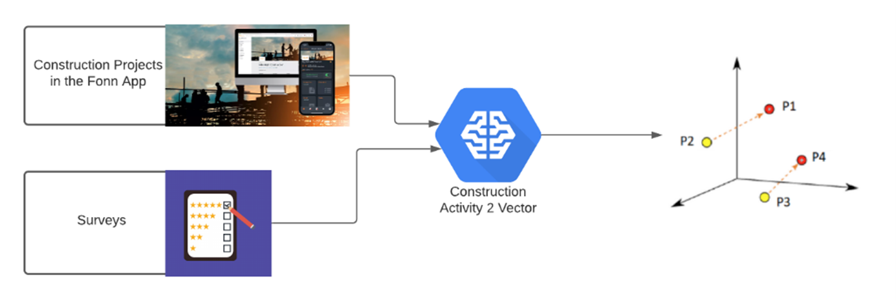

A project manager wants a healthy project, yet few projects are delivered in time, on budget, with proper quality, and customer satisfaction. It sounds like a great field to apply Artificial Intelligence (AI); track, monitor, and predict a Project’s Health automatically, in real-time, and for thousands of projects simultaneously.  Despite that AI is “eating the world”, why is it not eating the construction industry as well? 

Also in spite of the vast potential of artificial intelligence, it hasn't caught on in some industries, one of which is the construction industry. Why is this a case? According to Andrew Ng, the playbook that works for consumer internet companies such as Google or Amazon to build their AI systems — where a single one-size-fits-all AI system can serve massive numbers of users — won’t work for many other industries. Why is adopting AI outside of tech so hard? The most crucial challenge in AI adoption for the construction industry is data-related. Namely, too small datasets and lack of labeled data. On one hand, not every company can be like Amazon with millions of customers and products and billions of orders. Hence, not every company can build great a recommendation engine on top of massive datasets.
On the other hand, you have construction companies working on a couple of big projects (but only a couple of them), which don’t have sufficient data to develop AI models. Fonn investigated this challenge, and some time ago, started working on a solution for it. The solution enables users to get AI capabilities in the construction industry to track, monitor, and predict construction Project Health.

Moreover, Fonn conducted a literature review and surveyed project managers to investigate how Project Health is understood in the construction industry. It shows that projects have multiple types of traits that impact Project Health as the project progresses. Surveys report what managers think of a project after it is finished in terms of Satisfaction, Safety, Quality, and Costs. Fonn surveyed their clients to understand how they use the app and what makes their projects healthy in all stages of the project development. They combined project managers’ survey answers with project activity data in the Fonn app. It enabled them to understand what the most successful Fonn projects do to stay healthy, go to the next level of data quality in Fonn, and finally, build Artificial Intelligence solutions for the benefit of the construction industry and thousands of construction projects worldwide.

