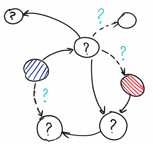

# Our objective

Design and implementation of AI-enabled solutions responsible for a reduction of transaction times, improvement of agent's productivity, and an increase in customer satisfaction. Implementation of state-of-the-art models for spoken language understanding.

<!-- 

  

 -->
